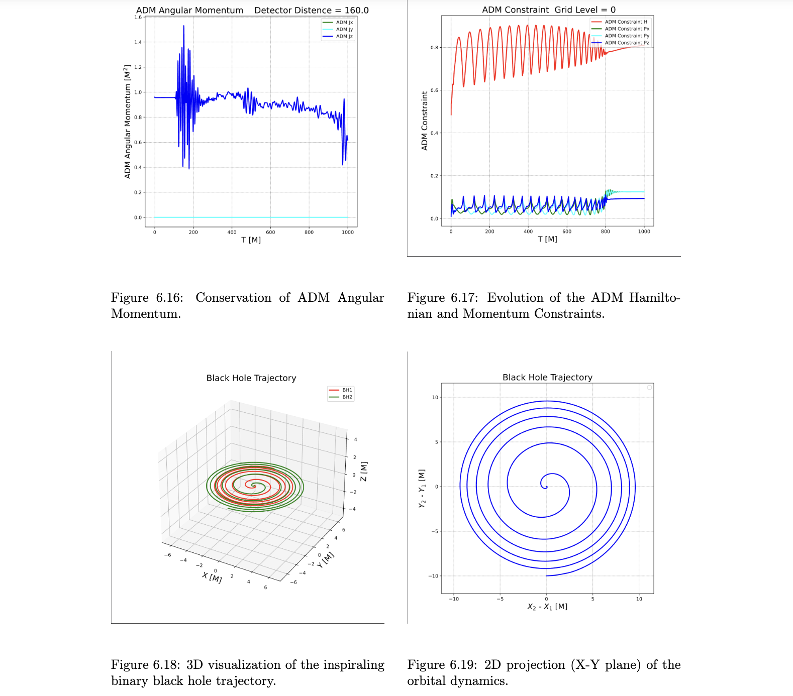

# AMSS-NCKU-GPU: GPU-Accelerated Numerical Relativity Code (ASC26)

## Overview

This repository hosts a heavily optimized, fully GPU-accelerated version of **AMSS-NCKU**, serving as the scientific computing application for the **ASC26 Student Supercomputer Challenge (Preliminary Round)**. 

Based on the [Original AMSS-NCKU Repository](https://github.com/ASC-Competition/AMSS-NCKU), this numerical relativity program is designed to solve Einstein's field equations, simulate binary black hole systems, and capture the released gravitational waves using adaptive mesh refinement (AMR) techniques. 

Our core contribution in this repository is a fundamentally re-engineered, completely device-resident GPU spacetime evolution pipeline that minimizes CPU intervention and maximizes modern HPC accelerator efficiency.

[See our proposal here](https://www.asc-events.net/StudentChallenge/ASC26/upload/ASC1514-8ba6e938-6ee3-545f-bf2b-c3c662181438.pdf). This repository's content belongs to Chapter 6.

## 🚀 Performance Breakthrough

By shifting the computational paradigm entirely to the GPU and applying deep hardware-aware optimizations, we achieved a massive **18.6X end-to-end speedup** for the spacetime evolution process, without compromising physical accuracy (RMS deviation < 0.05%).

- **Baseline (32-core MPI CPU):** 44,425 seconds
- **Optimized (Single NVIDIA A100 GPU):** **2,376 seconds**

## Key Optimizations

### 1. Fully GPU-Resident Spacetime Evolution (Core Contribution)
The evolution pipeline (`ABEGPU`) has been completely overhauled to maintain strict data residency on the GPU, effectively eliminating devastating PCIe transfer bottlenecks:
- **"Shadow Array" Architecture**: Replicated the complex host AMR linked-list structures into flat, contiguous device memory mappings, allowing the GPU to traverse grid hierarchies autonomously.
- **PCIe-Optimized Ghost Zone Synchronization**: Ghost zone extraction and packing are now executed purely on the GPU. By overlapping concurrent boundary-domain kernel launches with MPI Irecv/Isend, we successfully hide up to 68% of network latency behind useful arithmetic.
- **Multi-Stream Block-Level Concurrency**: Utilized asynchronous memory pooling (`cudaMallocAsync`) and dynamic CUDA stream assignments to execute multiple non-dependent AMR blocks concurrently, ensuring high Streaming Multiprocessor (SM) occupancy.
- **Register-Intensive Kernel Tuning**: Mitigated severe register spilling via aggressive kernel fission (decomposing the monolithic Z4c RHS kernel) and explicit launch bounds tuning.

### 2. CPU-Side Initial Data Generation (Secondary Optimization)
While the evolution phase is the primary focus, we also optimized the original serial `TwoPuncture` initial data solver using OpenMP. By eliminating high-concurrency heap contention (replacing dynamic allocations with thread-local buffers) and exposing independent computational planes for massive multi-threading, the initialization phase was accelerated by **~9.6X** (from ~548 seconds to ~57 seconds).

## The Development of AMSS-NCKU
- **2008**: Developed for binary and multiple black hole systems via BSSN equations.
- **2013**: Implemented Z4C equations, greatly improving calculation accuracy.
- **2015**: Introduced hybrid CPU/GPU computing for BSSN.
- **2024**: Developed a Python operation interface to facilitate usage.
- **2026 (This Repository)**: Comprehensive GPU-resident parallelization and CUDA-aware optimizations developed for the ASC26 competition.

## Quick Start

A stable and reproducible high-performance computing environment (using Spack or Conda) is required, including modern C++, Fortran, CUDA compilers, Python 3, and an MPI implementation.

For detailed environment variables, thread binding, and SLURM submission configurations, please directly refer to the `run.sh` script provided in this repository.

**Execution:**
```bash
# To run locally:
./run.sh

# To submit via Slurm workload manager:
sbatch run.sh

```

## Results & Limitations

Please note that currently, **only the specific physical equations and numerical approaches configured in [`AMSS_NCKU_Input.py`](AMSS_NCKU_Input.py) have been fully optimized and ported to the GPU.** Other numerical methods, boundary conditions, or equation formulations available in the original AMSS-NCKU framework have not been implemented in this GPU-accelerated version. We do not guarantee the correctness, stability, or performance of the code if it is migrated to or configured with other unoptimized methods.

Below are the simulation results generated using the currently supported GPU configurations:


*Figure: Description of the first result.*

## Authors

### Original AMSS-NCKU

- **Cao, Zhoujian** (Beijing Normal University; AMSS, CAS; HIAS, UCAS)
- **Yo, Hwei-Jang** (National Cheng Kung University)
- **Liu, Runqiu** (AMSS, CAS)
- **Du, Zhihui** (Tsinghua University)
- **Ji, Liwei** (Rochester Institute of Technology)
- **Zhao, Zhichao** (China Agricultural University)
- **Qiao, Chenkai** (Chongqing University of Technology)
- **Yu, Jui-Ping** (Former student)
- **Lin, Chun-Yu** (Former student)
- **Zuo, Yi** (Student)

### GPU-based AMSS-NCKU

*(Recent HPC optimizations and GPU pipeline restructuring contributed by the Zhejiang University Supercomputing Team).*

- **Tianyang Liu** [@jjsnam](https://github.com/jjsnam) (Zhejiang University, Student)
- **Yixun Hong** [@ForeverHYX](https://github.com/ForeverHYX) (Zhejiang University, Student)

## License
This project is licensed under a custom Time-Delayed Academic License. It will automatically transition to the MIT License after the ASC26 Finals. See the [LICENSE](LICENSE) file for details.